# TP4 : Création d’une API Restful avec Express JS

## Description

Ce projet est un exemple d'application backend en **Node.js** utilisant **Keycloak** pour l’authentification et la gestion des utilisateurs.  
Il illustre l’intégration d’un serveur d’authentification OpenID Connect avec des routes sécurisées et la persistance des données dans une base SQLite.

## Fonctionnalités

- Gestion des utilisateurs avec Keycloak (realm, client, mot de passe, rôles)
- Routes Node.js sécurisées par Keycloak
- Base de données SQLite pour stocker des informations spécifiques à l’application
- Documentation OpenAPI pour l’API

## Etape 5 : 
###  Test des Routes

 **GET** : récupérer les données.
 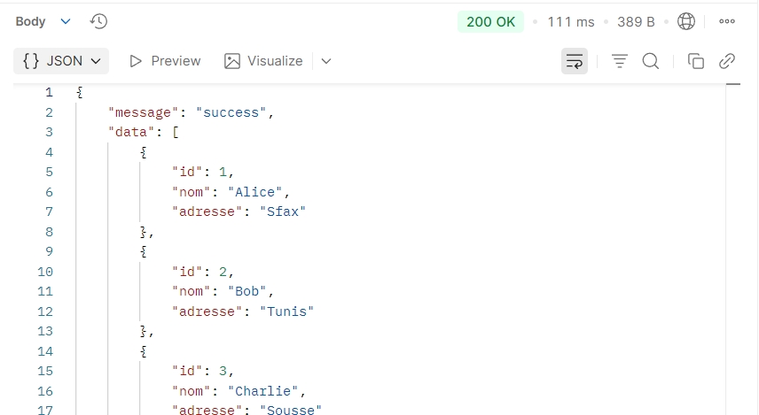
resultat : 
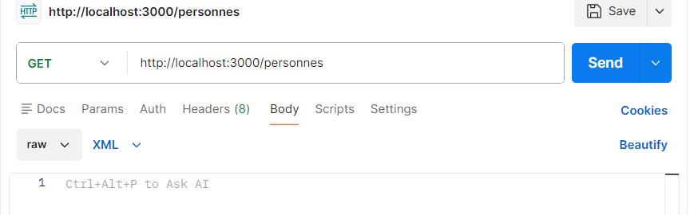

GET Personne par ID : 
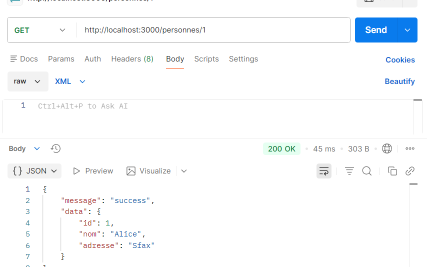

  - **POST** : ajouter de nouvelles données (ajoutez les données dans l’onglet `Body` → `raw` → `JSON`).
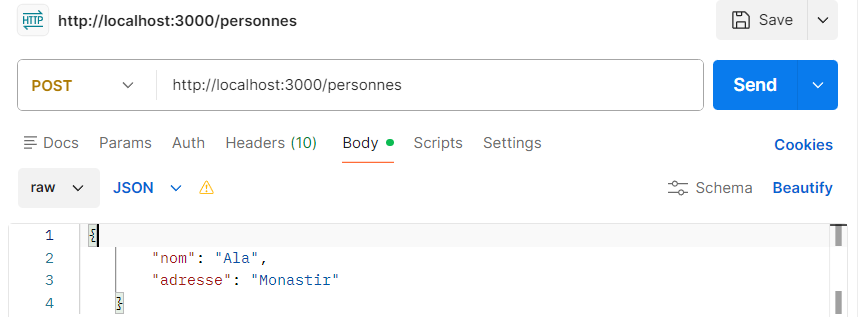
resultat : 
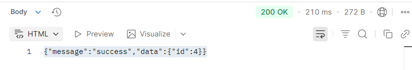

  - **PUT** : mettre à jour des données existantes (également via `Body` → `raw` → `JSON`).

  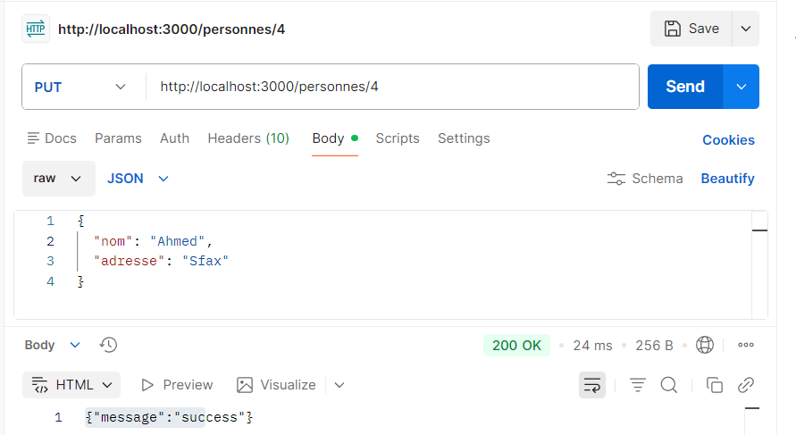

  - **DELETE** : supprimer des données.
  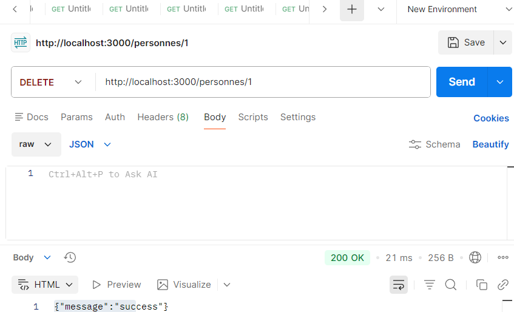

###  cas de données incorrectes 
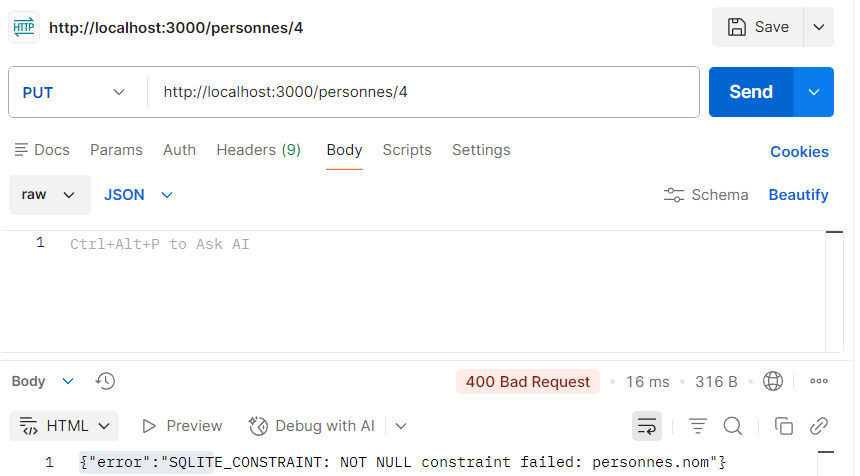
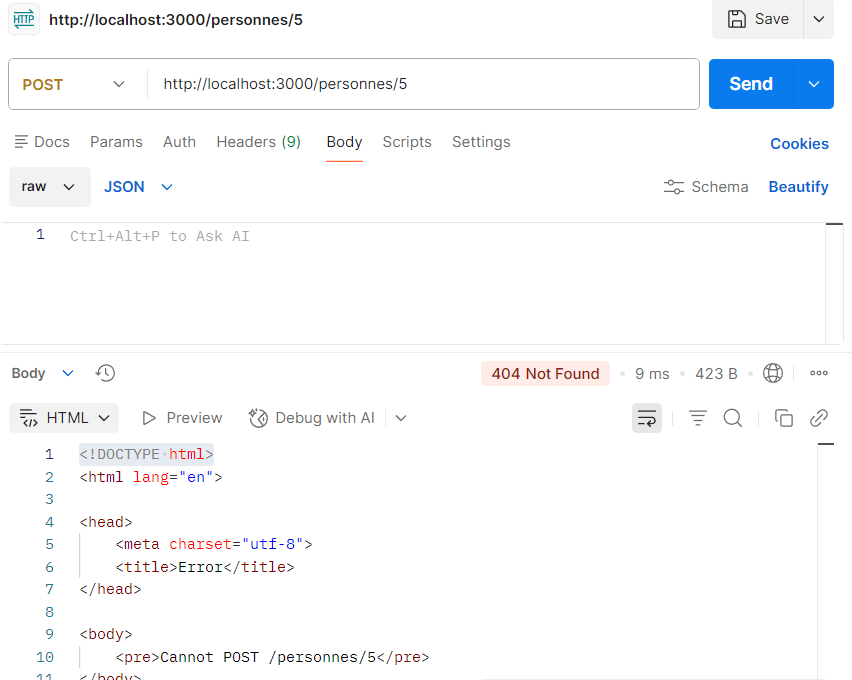
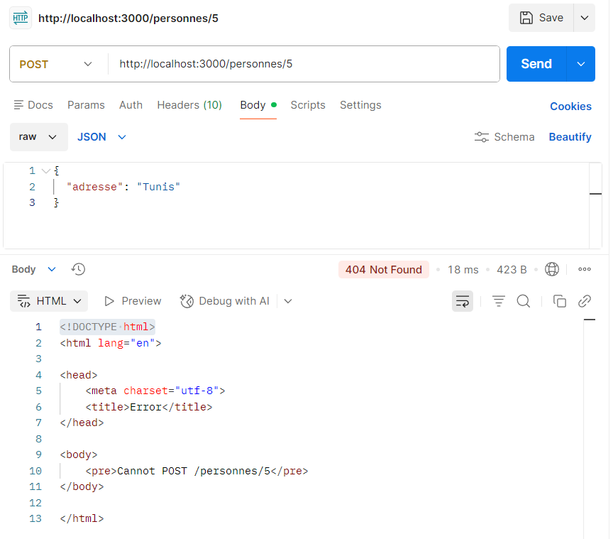

## Etape 6 : 
 1. Création d' un realm.

 2. configuration d'un client avec les paramètres nécessaires.
 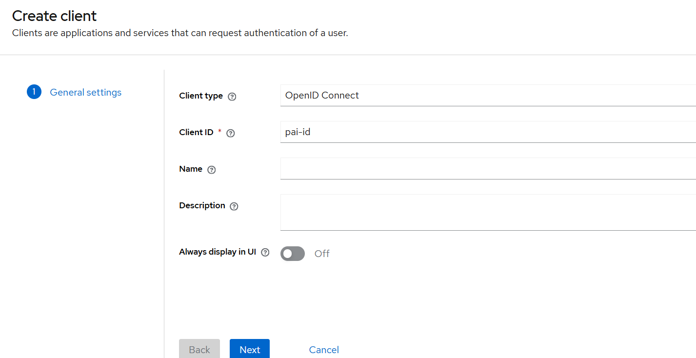
3. creation des utilisateurs pour tester.
    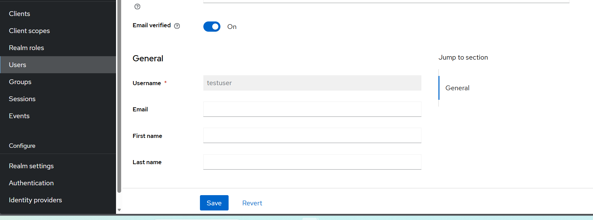
4. Testez les routes sécurisées avec Postman.
## Etape 7 :
 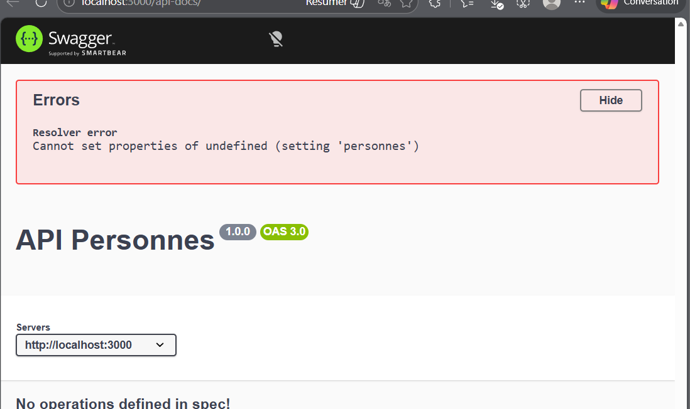